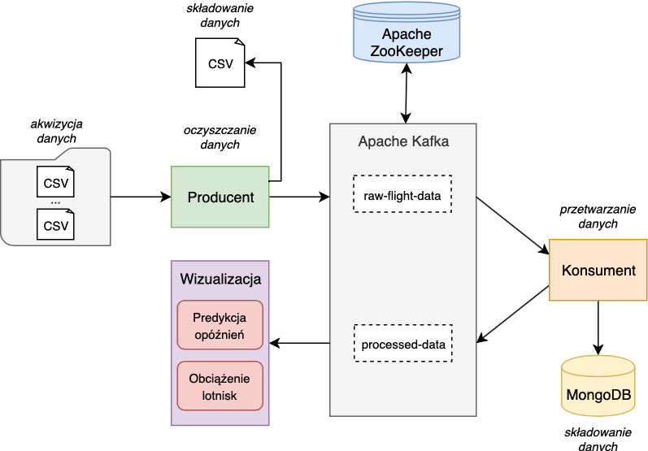
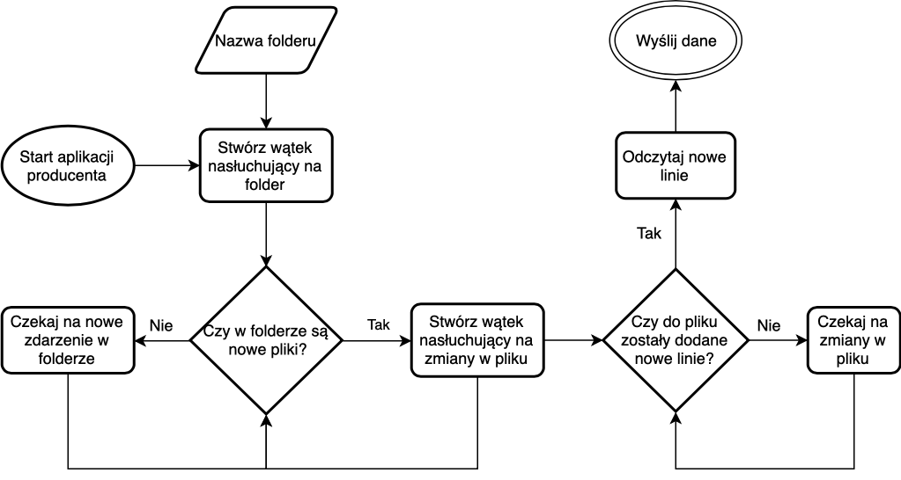
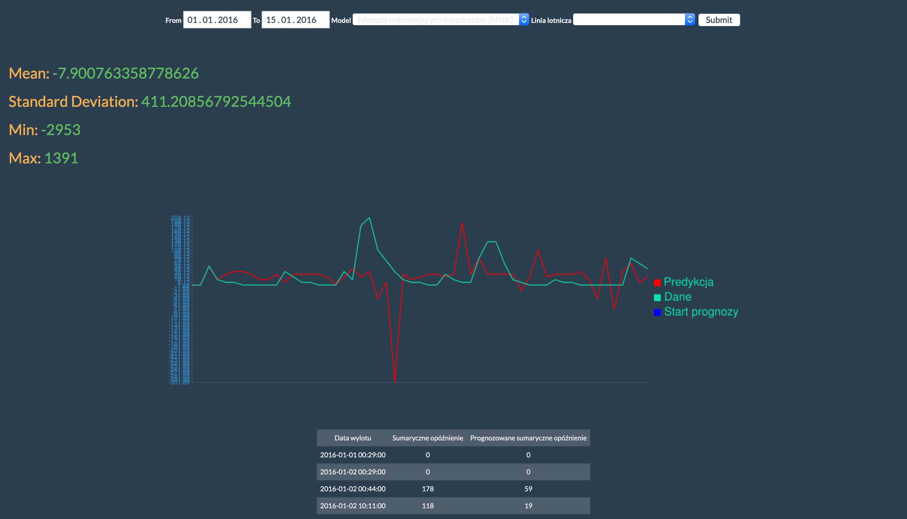
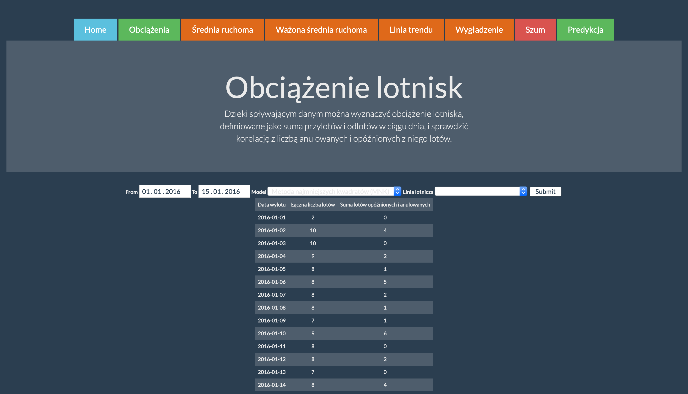

# raven

[](https://travis-ci.com/hvvka/raven)

Sequel to [innovative-project-jackdaw](https://github.com/nokia-wroclaw/innovative-project-jackdaw), but with Spring Kafka and other cool things.

```bash
$ docker-compose up -d
$ cd flight-producer && ./mount.sh && ./gradlew bootRun &
$ cd ../flight-consumer && ./gradlew bootRun & 
$ cd ../flight-visualization && npm install && npm start
```

Access [0.0.0.0:3000](http://0.0.0.0:3000)

## Architecture



## Dataset

[Flights tracked by the National Civil Aviation Agency in Brazil from 2015-01 to 2017-08](https://www.kaggle.com/ramirobentes/flights-in-brazil/data)

- Size: 655.15 MB
- Data characteristics:
     - 20 columns
     - standardized data (from one source)
     - data types:
         - 4 dates (planned / real arrival / departure)
         - 4 coordinates (departure, arrival)
         - information about: flight number, airline, whether the flight took place, the airport / country / state / city of departure / arrival,
- Other features:
     - one CSV file
     - data in Portuguese, but a translation is also available
     - data availability under license conditions CC0: Public Domain (full freedom)

## Data acquisition



Data acquisition process:

1. User places files in a folder.
1. The manufacturer's program listens for CSV files in the indicated folder - the path to the folder is given in the manufacturer's application.
1. Reading subsequent lines from files, if:
     - initially there are CSV files in the folder,
     - new CSV files appears in the folder,
     - new data appended to any CSV file.
1. Skip reading file header.
1. Data verification:
     - checking if the given line is not empty,
     - checking if the row contains 20 columns,
     - validation of data types.
1. Listening for further data to the file.

## Data storage

- CSV file
    
    Producer microservice contains a data schema (model) against which it validates the data obtained from the acquisition layer.
    The data obtained from the acquisition layer, which passes validation, is appended to the CSV file.

- Database

    The consumer saves the data read from Kafka, processes it and then saves in a database to ensure backups. The results of data processing is stored in MongoDB.

## Processing

1. Producer

- type validation (when embedding data in a schema / data model)
- lines with at least one entry in the incorrect format are rejected

2. Consumer

- the consumer reads the data received from Kafka and discards some of them (not useful for analysis)
- new information required by the visualization microservice is calculated
- a backup is created in the database
- final data is sent to the Kafka topic

## Visualization

AngularJS and the Node.js webapp. 

For the total delay (summary of departure and arrival delays) for each flight date there are given additional statistics:

- moving average
- weighted moving average 
- trend line
- smooting
- noise

### Flight delay prediction


The prediction is displayed for the specific **airline** (filter)
and **time interval** settings.

Future values are predicted due to the autoregressive model - prediction is based upon past input values.

Model coefficients can be calculated using one of two methods (filter):

- least squares approximation (NMK)
- maximum entropy method (MaxEnt)

Summary of real and predicted delays is presented in the table as well.



### Airport traffic

Airport trafiic is defined as the sum of arrivals and departures during the day. One can see the correlation with the number of canceled and delayed flights.

This analysis is displayed in a **table**. It has an airport filter.


